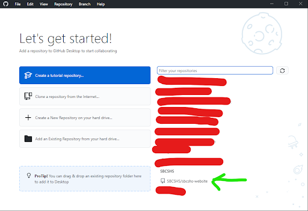
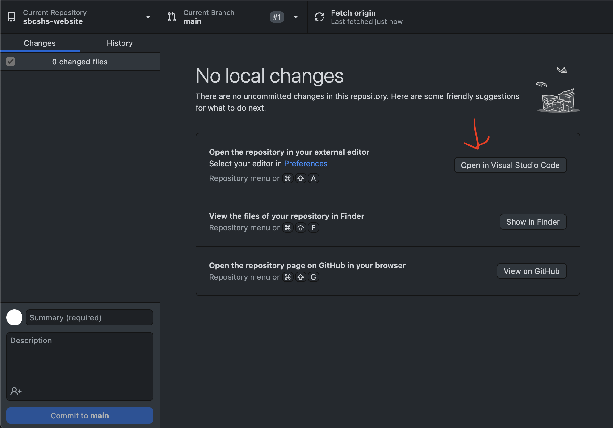

<!-- @format -->
<!-- markdownlint-disable MD041 -->


# sbcshs-website

This repository contains the source code for the website for Stone Bridge High School's Computer Science Honor Society.
:desktop_computer:

## Contributing

### Setup

To install all dependencies required to build the site, run

```sh
pip install mkdocs-material mkdocs-git-revision-date-localized-plugin mkdocs-glightbox pillow cairosvg
```

### Adding Images

When adding images, upload the file to `/overrides/assets/images`, then use HTML to add images.

<!-- prettier-ignore -->
```html

```

If adding images to index.md, change the `src` attribute to

```html

```

Refer to the [Material for MkDocs documentation](https://squidfunk.github.io/mkdocs-material/) to learn more about Material for MkDocs's capabilities.

## Setting up VSCode and Github

Install [VSCode](https://code.visualstudio.com/download).

Visit [GitHub](https://github.com/signup) and make an account.
(If you already have an account, skip this step)

Download [GitHub Desktop](https://desktop.github.com/) (unless you are familiar with git or other alternatives).
Note: If you don't want to/can’t install Desktop and/or VS code, you can do everything within the browser, but you may have limited access. I (Basil) am doing it on the browser and have been able to do everything just the same, though keep in mind that things may go wrong.

Sign into GitHub Desktop using your GitHub account.


Clone the repository.



If VSCode is installed, click the button "Open in Visual Studio Code".



### Extras

Extensions:

[Live Sass Compiler](https://marketplace.visualstudio.com/items?itemName=glenn2223.live-sass) (recommended):
Allows you to compile sass and scss files to css.

[Markdownlint](https://marketplace.visualstudio.com/items?itemName=DavidAnson.vscode-markdownlint) (recommended):
Provides formatting advice for the markdown language.

[Color Highlight](https://marketplace.visualstudio.com/items?itemName=naumovs.color-highlight):
Displays the color of an RGB or hex code value next to the value itself.

[Prettier - Code formatter](https://marketplace.visualstudio.com/items?itemName=esbenp.prettier-vscode)
General formatter for most popular languages.

<html>
    <header>
    </header>
    <figure>
        <a href="https://marketplace.visualstudio.com/items?itemName=esbenp.prettier-vscode">
            
            <figcaption>Prettier - Code formatter</figcaption>
        </a href>
    </figure>
    <figure>
        <a href="https://marketplace.visualstudio.com/items?itemName=naumovs.color-highlight">
            
            <figcaption>Color Highlight</figcaption>
        </a href>
    </figure>
</html>
