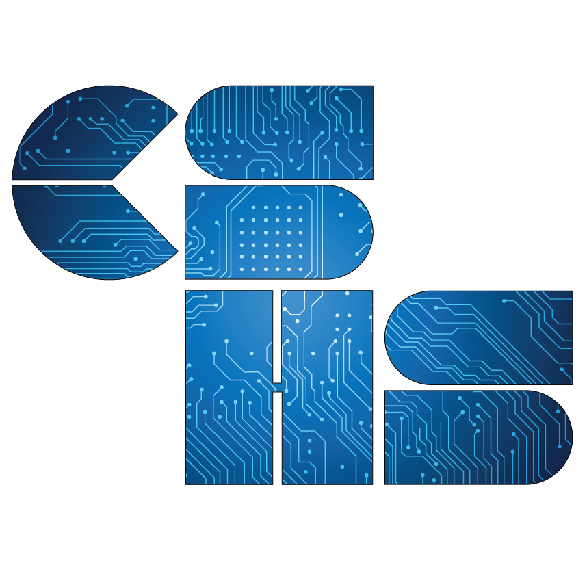

<!-- markdownlint-disable MD033 -->
<h1>CSHS Resources</h1>

This page has CSHS resources available here.

## Important Links

[Hours Tracker](https://docs.google.com/spreadsheets/d/1SV_Ki6cGMWb06zYWT06DEOEKLPU33jU1qxbgyJ5TMo4/edit#gid=0)

[Sign up for morning CS tutoring](https://docs.google.com/spreadsheets/d/1OMaOSE7EkTpV2Ytu_tOGrZkkFPUCH34BhQqC-eJfbYk/edit#gid=1669289070)

[Google form to submit hours](https://learn.lcps.org/link?a=2555928654&path=https%3A%2F%2Fforms.gle%2FVHtPviavADx6iNxh8)

## Join the Schoology and Remind

  Schoology Group Code : 5RMV-X737-QXKRF 

  Remind Code: @sbcshs2022 
